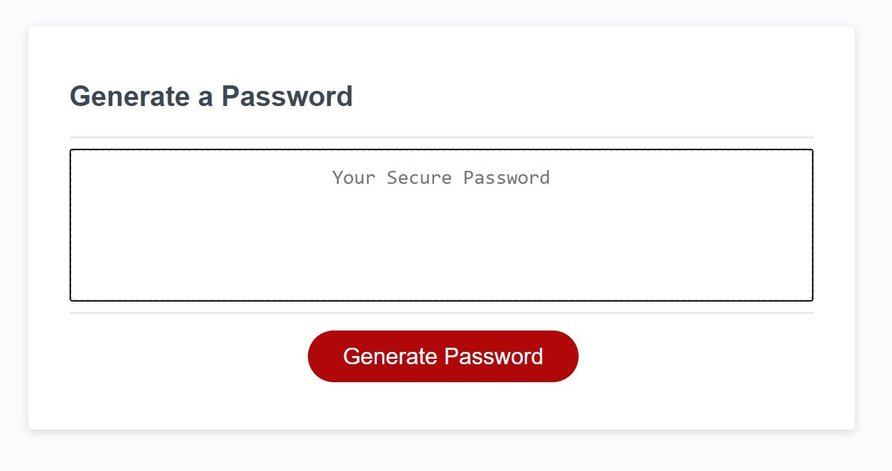
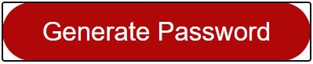
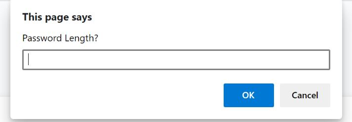
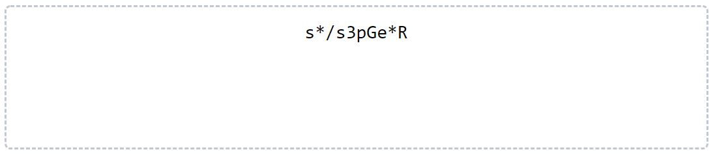

# PassWord Generator

### This License
The MIT License is a permissive free software license. As a permissive license, it puts only very limited restriction on reuse and has, therefore, high license compatibility.
## Table of Contents

[Description](#Description) [Usage](#Usage-Guidelines)  [Contribution](#Contribution) [Questions](#Questions)

## Description:
    
This is a password generator. Once loaded, the page loads a welcome prompt. Once the Generate Password button is pressed, 4 additional questions are prompted. Here you can decide which parameters to include for a password, such as lowercase alphabet, uppercase, numbers and special characters.
    
## Installation:
    

    
## Usage Guidelines:
    
This password generator is engineered using javascript, and built on HTML. After the page is loaded, click the generate password button.  Then follow along with the prompts, clicking ok if you want to include such characters and stating the length.   Afterward, the finished password will be added to the text box in the middle. 
    

## Contribution:
    
AJ Nieves
    
## Questions:
*Follow me on Github at [github.com/ajsnow56](https://github.com/ajsnow56)

*Email me at: ajsnow56@gmail.com